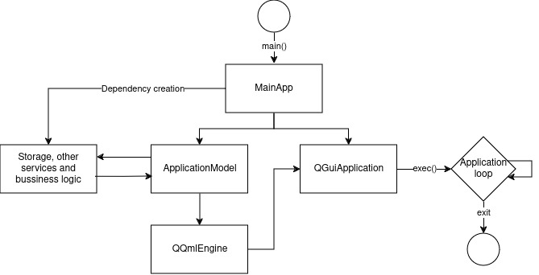

# QML Template

This project is intended as base template for extensible and component based system using Qt Quick.

## Building

Requirements:
* C++ compiler
* CMake
* qt-base, qt-declerative

```sh
# initialize cmake and generate .clang compile commands
cmake -B build -S . -DCMAKE_EXPORT_COMPILE_COMMANDS=ON

# build
cmake --build build -j

# run
./build/app
```

## Base structure



This project separates UI/UX from bussiness logic to improve testability and responsibility of each component. There are 3 main parts of the code, which are C++ source code, QML and View Models. It is based on [MVVM pattern](https://en.wikipedia.org/wiki/Model%E2%80%93view%E2%80%93viewmodel)

On C++ side MainApp serves as the entry point. It constructs Core Qt GUI application, starts the QML Engine, initializes QML Application Model, manages application dependencies and services. Everything should be plugged in through there.

As for QML, we start with ApplicationWindow, that required ApplicationModel and constructs application UI structure from there on. It communicates through View Models defined in `./models` and communicates with the application through them.

### Extensibility

This strucutre allows to extend UI separately from bussiness logic and change bussiness logic without affecting UI. We can create separate UI component, that uses the same view models, but behaves differently, or we can plug in different services that modify models without changing UI.

There is no limiting factor on how to implement each of these structures, all we need is to update bindings as necessary. For example, if we want to lazy remove items from `Storage`, we can implement signal mechanism or similar to `ToDoItem` to notify for deletion triggering some response mechanism in `StorageModel`, or we can do it retroactively, by removing items from QML by calling `model.items.remove(index)` and `StorageModel` can listen for `ToDoItems::rowsInserted` or `ToDoItems::rowsRemoved` or any custom signal we implement. Similarly, we are not limited to only one storage implementation, we can plug in SQL Storage, QSettings Storage, etc. As long as we have correct binding Model between bussiness logic and View Model.

### Testability

Code is structured so that separate components can be tested separately and allows us plugging in bussiness logic or UI/UX independently. We can test if `StorageModel` correctly updates `ToDoItems`, we can test `Storage` itself, or we can pass in custom `ToDoItems` for QML.

### UI/UX

Qt Quick allows us to use QML markup language to define our UI. There are a lot of Qt Quick Controls components already available for us, starting with Labels, Text, Buttons, TextInputs and more. QML uses anchoring mechanism to define anchors between components. We can further enhance the UI by leveraging Qt Quick Layouts, which allow us to define more complex UIs which can react to different usecases based on Layout attributes specified.

UI should be divided in simple Components, that can be reused for different scenarios, starting with view components, which define whole pages, and ending with customizable elements, like list elements, buttons, popups and more.

## Multi platform support

Qt Quick and Qt in its nature is multi-platform. It supports everything starting from Desktop (Windows, Unix, MacOS), mobile (Android and iOS) and embedded systems. Qt GUI Application supports all of these platforms on its own, but we are using QML for UI definition and markup. Project should rely on layouts and anchoring system extensively to support any window sizes and can respond to window changes seemlessly.

We can also define different Application Windows to specify more in depth and in `CMakeLists.txt` define which ApplicationWindow should be initialzied if necessary. However, one ApplicationWindow implementation should be enough as we can adjust layout and anchoring based on width and height of the window and other UI/UX requirements.
